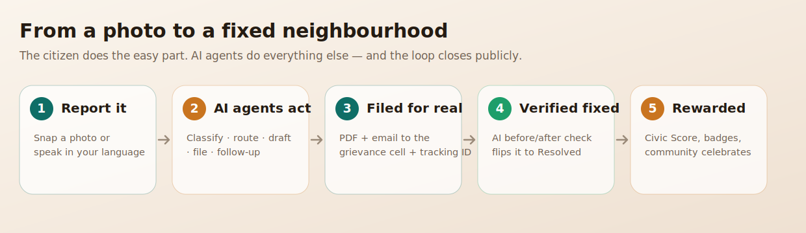
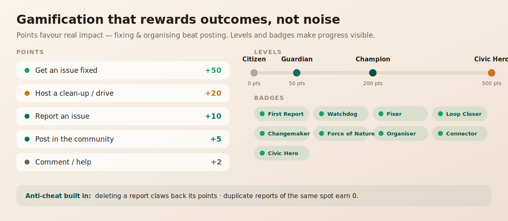
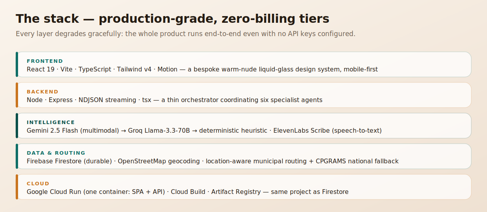

<div align="center">


# Jagrik — Project Documentation

**Hyperlocal civic-action, powered by AI agents.**
*See it. Say it. Solved.*

<p>


</p>

**🔗 Live app:** https://jagrik-550338729500.asia-south1.run.app
**🏆 Track:** Vibe2Ship · Problem Statement 2 — *Community Hero*

</div>

---

## Table of contents
1. [The problem](#1-the-problem)
2. [The solution](#2-the-solution)
3. [How a citizen creates change](#3-how-a-citizen-creates-change)
4. [Key features](#4-key-features)
5. [System architecture](#5-system-architecture)
6. [The multi-agent pipeline](#6-the-multi-agent-pipeline)
7. [Real-world routing & national coverage](#7-real-world-routing--national-coverage)
8. [Gamification & community](#8-gamification--community)
9. [Technology stack](#9-technology-stack)
10. [Deployment on Google Cloud](#10-deployment-on-google-cloud)
11. [What makes Jagrik stand out](#11-what-makes-jagrik-stand-out)
12. [Challenges we solved](#12-challenges-we-solved)
13. [Future scope](#13-future-scope)

---

## 1. The problem

Reporting a civic issue in India is broken:

- **You don't know who's responsible.** A pothole, a choked drain, and a dead streetlight each belong to a different municipal department.
- **The portals are hostile.** They demand forms in formal English, ward numbers, and categories most citizens don't know.
- **There's no feedback loop.** No acknowledgement, no tracking, and no proof when (or if) anything is fixed.

So most people simply **don't report** — and the neighbourhood stays broken. The civic-engagement gap isn't apathy; it's friction.

---

## 2. The solution

**Jagrik turns a photo or a spoken sentence into a filed, tracked, AI-verified civic complaint.**

A citizen does the easy part — point a camera or just talk, in Bengali, Hindi, or English. A team of AI agents does everything else: understands the problem, finds the right authority, writes a formal complaint, files it for real with a tracking ID, and closes the loop with before/after verification — then celebrates the win with the whole neighbourhood.

> **Jagrik** = *Jagruk* (aware) + *Nagrik* (citizen) — the aware citizen.

---

## 3. How a citizen creates change

<div align="center">

</div>

The entire journey is **zero-friction**: no login wall (just a name), no forms, no jargon. The citizen speaks once; the system carries it all the way to resolution.

---

## 4. Key features

| Feature | What it does |
|---|---|
| 🎙 **Voice-first, multilingual** | Speak in Bengali/Hindi/English. ElevenLabs Scribe transcribes; the citizen **verifies and edits** the transcript and can **view it translated** before filing. |
| 🧠 **Multimodal understanding** | Gemini reads the photo *and* the speech — issue type, severity 1–5, estimated repair cost, and a plain-language risk line. |
| 🏛 **Location-aware routing** | The right municipal body (KMC, BMC, BBMP, MCD, GHMC…) is resolved from GPS via OpenStreetMap — works in **any** Indian city. |
| ✍️ **Real action** | Generates a formal complaint PDF and **sends a real email** to the body's central grievance cell, with a tracking ID. |
| 🔁 **AI before/after verification** | Upload an "after" photo; Gemini compares it to the original and flips the issue to **Resolved** — proof, not a toggle. |
| 🎉 **Closes the loop publicly** | A verified fix **auto-posts a celebration** to the community feed, crediting the reporter. |
| 🏆 **Civic Score + leaderboard** | Points reward outcomes and helping; levels, badges, and a **Community Hero** spotlight by neighbourhood. |
| 👥 **Community hub** | Announcements, help requests, alerts, polls, and **clean-up events** — neighbours organising together. |
| 📊 **Predictive dashboard** | Where issues cluster and what's likely coming next. |
| 🚨 **Resource directory** | One-tap emergency + city-aware civic helplines. |

---

## 5. System architecture

<div align="center">

</div>

A **thin orchestrator** runs the agents in sequence and **streams each step as NDJSON** — that live stream *is* the on-screen progress view ("Action in motion"). The intelligence lives in the agents; plain code just coordinates. Because the UI renders the real step stream, it's **genuinely live**, not an animation.

**Tiered AI — the demo never dies.** Every AI call falls through **Gemini 2.5 Flash → Groq Llama-3.3-70B → a deterministic heuristic**. No key, no network, no problem — the pipeline always produces a sensible result.

---

## 6. The multi-agent pipeline

| # | Agent | Responsibility |
|---|---|---|
| 1 | **Classifier** | Reads photo + transcribed speech → issue type, severity, cost estimate, risk context. |
| 2 | **Dedupe** | Checks for an existing report of the same issue at the same place. |
| 3 | **Router** | Maps the issue to the correct municipal department and grievance channel for that city. |
| 4 | **Drafter** | Writes a formal English complaint, attaching the citizen's original words. |
| 5 | **Dispatcher** | Builds the PDF and emails the authority (Test or Live mode). |
| 6 | **Escalator** | Schedules an automatic follow-up if the complaint isn't acknowledged in time. |

---

## 7. Real-world routing & national coverage

India's civic grievance reality is that **most municipal bodies take complaints through portals, apps, and helplines — not a single public email.** So Jagrik routes to the channels that are **real and verifiable**:

- **Per-city complaint portal** (KMC e-form, BMC `qlcomplaintreg`, BBMP Sahaaya, MCD 311…)
- **Per-city civic helpline** (BMC 1916, BBMP/NDMC 1533, Chennai 1913, GHMC 040-2111-1111…)
- A **Test / Live toggle**: Test (default) shows the routing but sends to a controlled inbox so officials are never spammed during a demo; Live emails the body's central grievance cell.

**No location goes unheard.** Any city Jagrik doesn't recognise — and any missing location — falls back to **CPGRAMS** (`pgportal.gov.in`), the Government of India's national grievance system **linked to all 36 states/UTs**.

---

## 8. Gamification & community

<div align="center">

</div>

Points deliberately favour **real impact** — getting an issue *fixed* (+50) and *hosting a clean-up* (+20) beat posting (+5). Progress is visible through four levels and nine badges, and each neighbourhood's top citizen is featured as a **Community Hero** with their location. Crucially, the scoring is **honest**: deleting a report claws back its points, and duplicate reports of the same spot earn nothing — so the leaderboard can't be farmed.

---

## 9. Technology stack

<div align="center">

</div>

Every capability is wrapped in a **graceful flag**: the product runs end-to-end even with **zero API keys** (classification falls back to a heuristic, email is simulated and clearly labelled). Add keys and each capability goes live — no code change.

---

## 10. Deployment on Google Cloud

Jagrik is deployed as a **single Google Cloud Run service** — one container that serves the built React SPA **and** the `/api` routes, in the **same GCP project as Firestore** (`jagrik-a3357`). Because the frontend calls `/api` on the same origin, there's no CORS and no proxy.

```bash
gcloud run deploy jagrik --source . --region asia-south1 \
  --allow-unauthenticated --memory 512Mi --env-vars-file gcp.env.yaml
```

- **Build:** Cloud Build compiles the `Dockerfile` (`npm ci → npm run build → npm run start`).
- **Runtime:** Cloud Run injects `PORT`; Firestore holds durable data and re-seeds the demo on startup.
- **Always-on option:** `--min-instances 1` keeps the link instantly responsive throughout judging.

**Live URL:** https://jagrik-550338729500.asia-south1.run.app

---

## 11. What makes Jagrik stand out

- **It takes real action.** Not a mockup — actual PDF generation, real email dispatch, and a tracking ID.
- **It closes the loop with proof.** AI before/after verification is the difference between "reported" and *fixed*.
- **It's truly inclusive.** Voice-first and multilingual, with transcript verification + translation, so a non-English speaker can file a formal complaint in seconds.
- **It's a system, not a form.** Reporting feeds a community that organises, celebrates wins, and competes to improve — turning a one-off complaint into sustained civic energy.
- **It never breaks.** Tiered AI + graceful fallbacks mean the product always works, on stage or off.

---

## 12. Challenges we solved

| Challenge | Solution |
|---|---|
| Outbound SMTP blocked on free hosts | Switched real email to the **Resend HTTP API**. |
| AI rate-limits / outages mid-demo | **Three-tier fallback** (Gemini → Groq → heuristic). |
| "One report for every location" | **Reverse geocoding** + location-aware municipal routing. |
| Fake-point farming | **Revoke on delete** + **duplicate detection**. |
| Most bodies have no public grievance email | Route to **verified portals + helplines** with a **CPGRAMS** national fallback. |
| Mandatory Google Cloud, zero real cost | **Cloud Run + Firestore** on free tiers in one project. |

---

## 13. Future scope

- **Official integrations** with municipal complaint APIs for true two-way status sync.
- **Phone/OTP identity** for verified accountability (kept optional to preserve zero-friction reporting).
- **Worker / authority dashboard** to triage, assign, and resolve from the other side.
- **WhatsApp bot** intake — meeting citizens where 500M Indians already are.
- **ML hotspot forecasting** trained on resolved-issue history for proactive maintenance.

---

<div align="center">
<sub>Built for <b>Vibe2Ship</b> · Problem Statement 2 — Community Hero · <b>Jagrik</b> = <i>Jagruk</i> + <i>Nagrik</i></sub>
</div>
