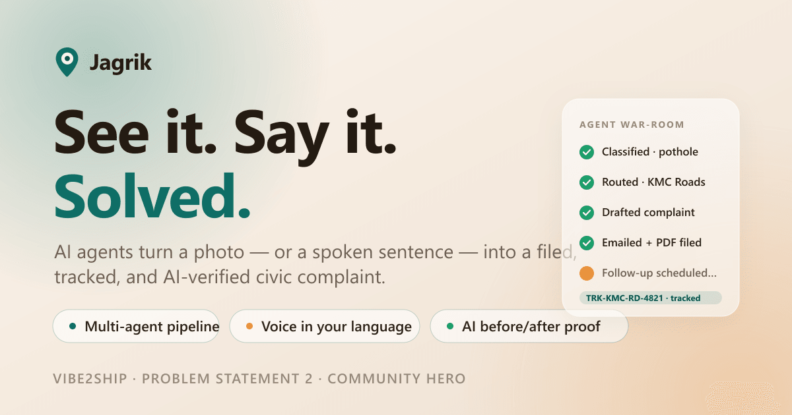
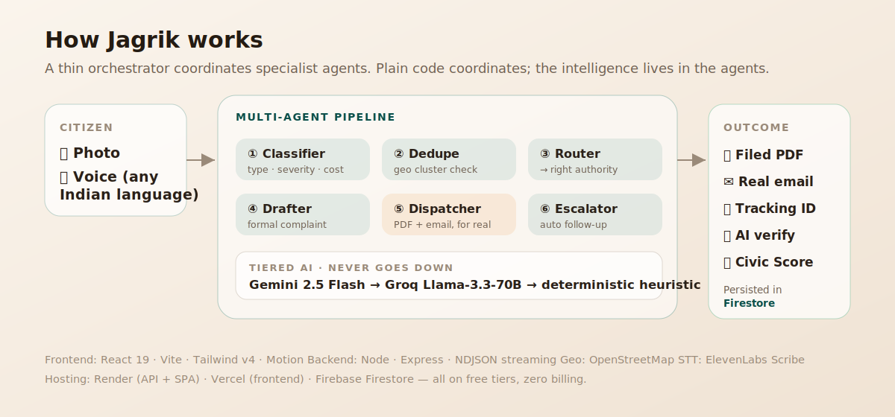

<div align="center">



<h1>Jagrik — <em>See it. Say it. Solved.</em></h1>

**Hyperlocal civic-action, powered by AI agents.**
Snap a photo or speak a sentence in your language — Jagrik classifies the problem, finds the right municipal authority, writes a formal complaint, files it for real, tracks it to resolution, and verifies the fix with a before/after photo check.

<p>


</p>

**🔗 Live on Google Cloud Run:** [jagrik-550338729500.asia-south1.run.app](https://jagrik-550338729500.asia-south1.run.app) &nbsp;·&nbsp; **Vibe2Ship — Problem Statement 2 · Community Hero**

</div>

---

## The problem

Reporting a civic issue in India is broken. You don't know **which** department owns a pothole vs. a drain vs. a streetlight. The complaint portals want forms in formal English. There's no acknowledgement, no tracking, and no proof when (or if) it's ever fixed. So most people simply don't report — and the neighbourhood stays broken.

## What Jagrik does

A citizen does the easy part — **point a camera or just talk**. AI agents do everything else:

| | |
|---|---|
| 🧠 **Understands** | Gemini reads the photo *and* the spoken complaint (Bengali, Hindi, English) — issue type, severity 1–5, estimated repair cost, risk context. |
| 🏛 **Routes** | Maps the issue to the **real** municipal body for that location (KMC, MCD, BMC, BBMP, GCC…) — detected from GPS via OpenStreetMap, not hardcoded. |
| ✍️ **Drafts & files** | Writes a formal English complaint, generates a PDF, and **sends a real email** to the department — with a tracking ID. |
| 🔁 **Closes the loop** | Upload an "after" photo; Gemini compares before/after and flips the issue to **Resolved**, then auto-celebrates the win in the community feed. |
| 🏆 **Rewards** | A **Civic Score** + leaderboard turns reporting and fixing into a game. Resolution is worth the most. |
| 👥 **Organises** | A community hub (announcements, help requests, alerts, polls), a predictive hotspot dashboard, and a one-tap **emergency + civic helpline directory**. |

---

## How it works

<div align="center">

</div>

A thin orchestrator runs the agents in sequence and **streams each step as NDJSON** — that live stream *is* the on-screen "war-room" the user watches. The intelligence lives in the agents; plain code just coordinates. Because the war-room renders the real step stream, it is **real**, not an animation.

**Tiered AI — the demo never dies:** every AI call falls through **Gemini 2.5 Flash → Groq Llama-3.3-70B → a deterministic heuristic**. No key, no network, no problem — the pipeline always produces a sensible result.

---

## Standout features

- **Voice-first, multilingual** — speak in Bengali/Hindi/English; ElevenLabs Scribe transcribes, Gemini understands, the complaint comes out in formal English with your original words attached.
- **Real action, not a mockup** — actual PDF generation and real email dispatch (via Resend HTTP API; Render's free tier blocks SMTP, so we route around it).
- **AI before/after verification** — proof a fix actually happened, not just a status someone toggled.
- **Civic Score + neighbourhood leaderboard** — gamification that rewards *outcomes* and *helping*, not spam.
- **Location-aware** — works in any Indian city; the right authority is resolved from real coordinates.
- **Zero billing** — Render + Vercel + Firebase Spark + free AI tiers. No credit card anywhere.

---

## Tech stack

**Frontend** — React 19, Vite, TypeScript, Tailwind v4, Motion. A bespoke warm-nude **liquid-glass** design system, light-theme-locked, mobile-first with a glass bottom-nav.
**Backend** — Node + Express, NDJSON streaming, `tsx`. Multi-agent orchestrator.
**AI** — Google Gemini 2.5 Flash (multimodal) · Groq (fallback) · ElevenLabs Scribe (STT).
**Data** — Firebase Firestore (durable) with an in-memory fallback. OpenStreetMap Nominatim for geocoding.
**Hosting** — Render (API + SPA), Vercel (frontend), all free tier.

> Full product/spec docs live in [`/Docs`](./Docs); build decisions in [`DECISIONS.md`](./DECISIONS.md).

---

## Getting started

```bash
# 1. install
npm install

# 2. add your keys (all optional — the app degrades gracefully without them)
cp .env.example .env   # then fill in what you have

# 3. run web + API together
npm run dev            # web on :5173, API on :8787 (Vite proxies /api → 8787)
```

Open **http://localhost:5173** and tap **Report a problem**. If the backend is down, the report flow falls back to a local simulator so the demo never breaks.

### Environment variables

| Var | Purpose | Required? |
|---|---|---|
| `GEMINI_API_KEY` | Multimodal classify / draft / verify | Optional — falls back to Groq, then heuristic |
| `GROQ_API_KEY` | Text fallback tier | Optional |
| `ELEVENLABS_API_KEY` | Voice transcription | Optional |
| `RESEND_API_KEY` | Real email dispatch | Optional — otherwise email is simulated |
| `FIREBASE_SERVICE_ACCOUNT_B64` | Durable Firestore storage | Optional — otherwise in-memory |
| `DEMO_INBOX` | Where demo complaints are delivered | Optional |

> Everything is built around **graceful capability flags** — each feature reports whether it's running live or in fallback, so the product works end-to-end with **zero** keys configured.

### Useful scripts

```bash
npm run dev:web / dev:server          # run either half alone
npm run build                         # typecheck + production build to dist/
npm run start                         # serve the built SPA + API from one process
npm run typecheck:server              # typecheck the backend
npx tsx scripts/cleanup-and-seed.ts   # refresh demo issues + leaderboard in Firestore
```

---

## Deploy — Google Cloud Run

One container serves the built SPA **and** `/api/*`, so a single Cloud Run service is the whole app. It lives in the same GCP project as Firestore — fully Google-native.

```bash
gcloud config set project jagrik-a3357
gcloud services enable run.googleapis.com cloudbuild.googleapis.com artifactregistry.googleapis.com
cp gcp.env.example.yaml gcp.env.yaml   # fill in your keys (gitignored)
gcloud run deploy jagrik --source . --region asia-south1 \
  --allow-unauthenticated --memory 512Mi --env-vars-file gcp.env.yaml
```

The `Dockerfile` runs `npm ci → npm run build → npm run start`. Cloud Run injects `PORT`; the frontend calls `/api` on the same origin (no CORS, no rewrites). Durable data lives in Firestore; demo issues/leaderboard re-seed at startup. Add `--min-instances 1` to keep it always-warm during judging.

> Also runs unchanged on **Render** (`render.yaml`) + **Vercel** as a fallback — same Firestore, so data stays consistent across all three.

---

## Demo flow (≈3 min)

1. **Report** — speak a complaint in Bengali → watch the six agents stream live in the war-room.
2. **Score** — see the **+10 Civic Score** banner; open the **leaderboard**.
3. **Verify** — open a seeded issue → upload an "after" photo → Gemini confirms the fix → it flips to **Resolved** and **auto-posts a celebration** to the community.
4. **Explore** — the predictive **hotspot dashboard** and the one-tap **emergency/civic helpline directory**.

---

<div align="center">
<sub>Built for <b>Vibe2Ship</b> · Problem Statement 2 — Community Hero. &nbsp;•&nbsp; <b>Jagrik</b> = <i>Jagruk</i> (aware) + <i>Nagrik</i> (citizen).</sub>
</div>
